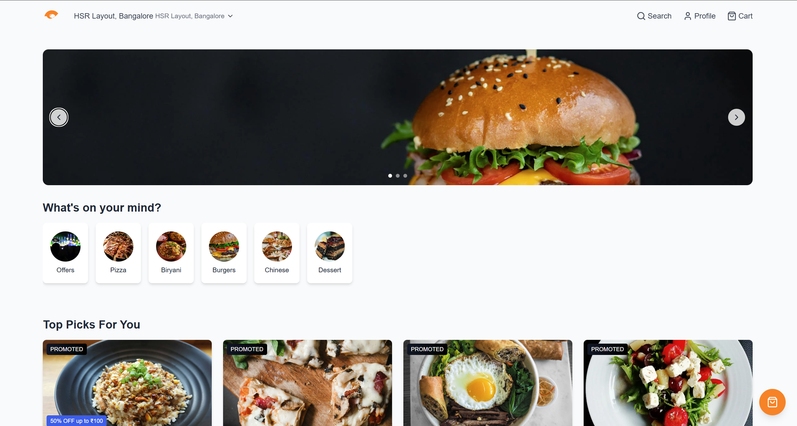
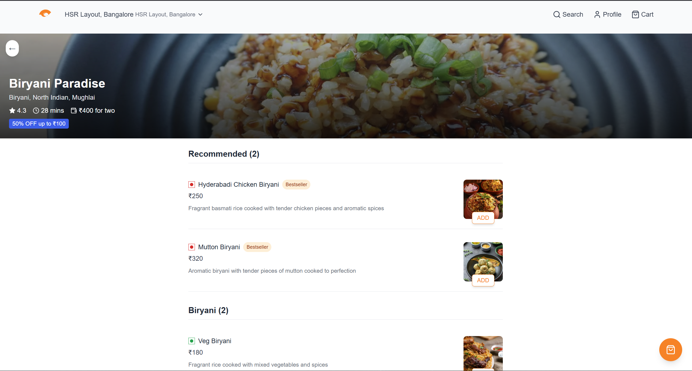
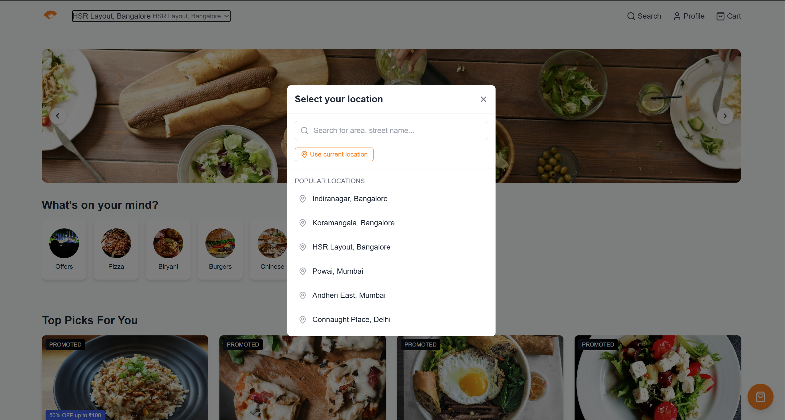

# 🍔 Food App

A sleek, responsive food ordering web app inspired by Swiggy & Zomato — built using **React (TypeScript)**, **Vite**, and **Tailwind CSS**.  
Users can explore restaurants, browse menus, and discover delicious food options, all within a smooth and modern interface.

 **Live Demo:** [https://food-app-gilt-nine.vercel.app/](https://food-app-gilt-nine.vercel.app/)

---

##  Screenshots

###  Home Page


###  Restaurant Menu


###  Location Selector


---

##  Overview

**Food App** provides an interactive experience for browsing food categories and restaurant menus.  
The UI mimics real-world food delivery apps with location selection, recommendations, and menu listings.

###  Key Highlights
- Smart location selector (use current location or pick manually)
- Explore cuisines — Pizza, Biryani, Burgers, Chinese, Desserts, and more
- View restaurant details, menus, and offers
- Add-to-cart interactions (UI level)
- Fully responsive modern design
- Built with TypeScript for better scalability and type safety

---

##  Tech Stack

| Category | Technology |
|-----------|-------------|
| **Frontend** | React + TypeScript |
| **Build Tool** | Vite |
| **Styling** | Tailwind CSS |
| **Routing** | React Router DOM |
| **State Management** | React Context API |
| **Deployment** | Vercel |

---

##  Project Structure

```
Food-App/
├── dist/
├── node_modules/
├── src/
│   ├── components/
│   ├── context/
│   ├── data/
│   ├── images/
│   │   ├── HomePage.png
│   │   ├── LocationSelector.png
│   │   └── RestaurantPage.png
│   ├── types/
│   ├── App.tsx
│   ├── index.css
│   ├── main.tsx
│   └── vite-env.d.ts
├── index.html
├── package.json
├── package-lock.json
├── postcss.config.js
├── tailwind.config.js
├── tsconfig.json
├── tsconfig.app.json
├── tsconfig.node.json
├── vite.config.ts
└── eslint.config.js
```

---

##  Features

- 📍 **Location Selector:** Search or auto-detect your location  
- 🍔 **Food Categories:** Browse popular cuisines and offers  
- 🍽️ **Restaurant Page:** Shows menus, prices, ratings, and offers  
- 💬 **Reusable Components:** Modular React structure  
- 🛒 **Cart UI:** Simple cart icon for user feedback  
- 📱 **Responsive:** Optimized for mobile and desktop  
- ⚡ **Fast Development:** Built with Vite + TypeScript  

---

##  Getting Started

### 1️⃣ Clone the Repository
```bash
git clone https://github.com/Kushagra001/Food-App.git
cd Food-App
```

### 2️⃣ Install Dependencies
```bash
npm install
# or
yarn install
```

### 3️⃣ Run the Development Server
```bash
npm run dev
```

Now open **http://localhost:5173** in your browser 🎉

---

##  Environment Variables

Currently, the app uses **mock data** and doesn’t require environment variables.

If integrating APIs later, create a `.env` file in the project root:

```
VITE_API_BASE_URL=https://api.example.com
```

Then access via:
```ts
import.meta.env.VITE_API_BASE_URL
```

---

##  Available Scripts

| Command | Description |
|----------|--------------|
| `npm run dev` | Start development server |
| `npm run build` | Build app for production |
| `npm run preview` | Preview production build |
| `npm run lint` | Run ESLint checks |

---

##  Deployment

The app is hosted on **Vercel**.

### Deploy in 3 Steps
1. Push your repo to GitHub  
2. Import it into [Vercel](https://vercel.com/)  
3. Deploy — Vercel automatically detects React + Vite configuration  

✅ **Live Example:** [https://food-app-gilt-nine.vercel.app/](https://food-app-gilt-nine.vercel.app/)

---

##  Contributing

Contributions are welcome!

1. Fork this repository  
2. Create a new branch:  
   ```bash
   git checkout -b feature/my-feature
   ```
3. Commit your changes:  
   ```bash
   git commit -m "Add my feature"
   ```
4. Push and create a Pull Request 🚀

---

##  Future Enhancements

- 🔐 Add authentication (Login / Signup)  
- 🧾 Connect to live restaurant API  
- 💳 Add payment gateway integration  
- 🛍️ Persistent cart and checkout  
- 🌙 Dark mode support  

---

## 🧑 Author

**Kushagra Singh Negi**  
🎓 MCA Student | 💻 Full Stack Developer  
🔗 GitHub: [@Kushagra001](https://github.com/Kushagra001)

---

## 📄 License

This project is licensed under the **MIT License**.  
You are free to use, modify, and distribute it with attribution.

---

## ⭐ Acknowledgements

- UI inspired by **Swiggy**
- Built with ❤️ using **React**, **TypeScript**, and **Tailwind CSS**  
- Deployed on **Vercel** for fast CI/CD

---
